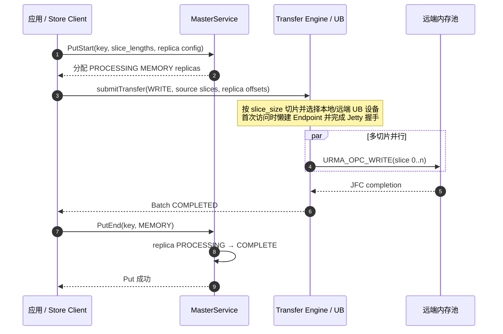
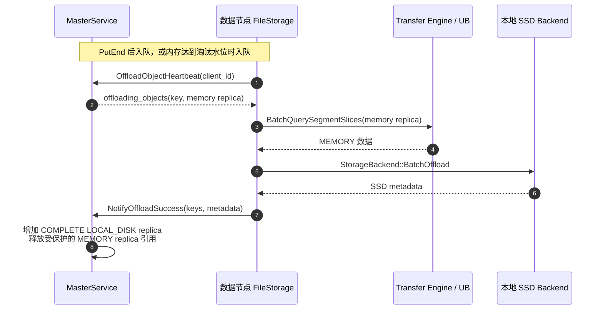
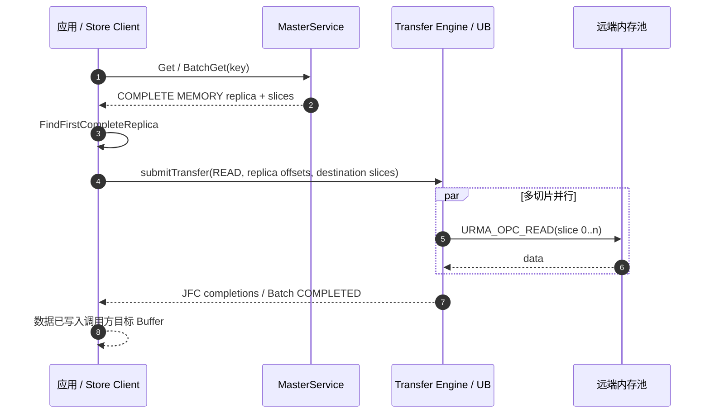
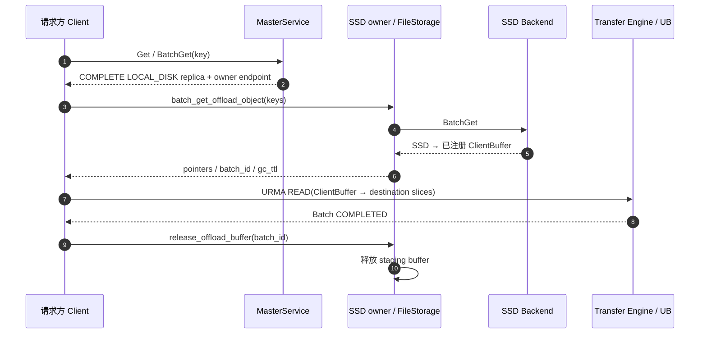
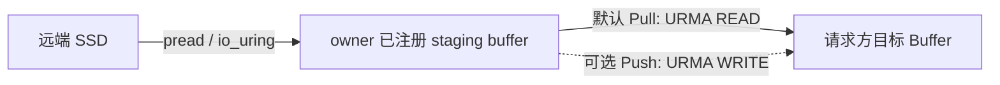
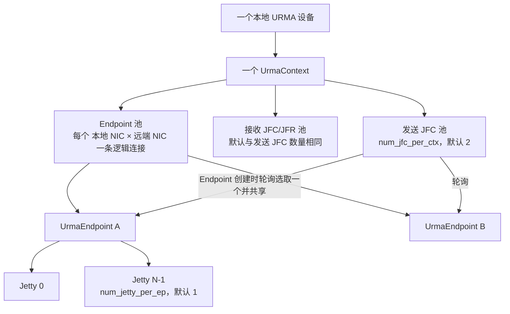
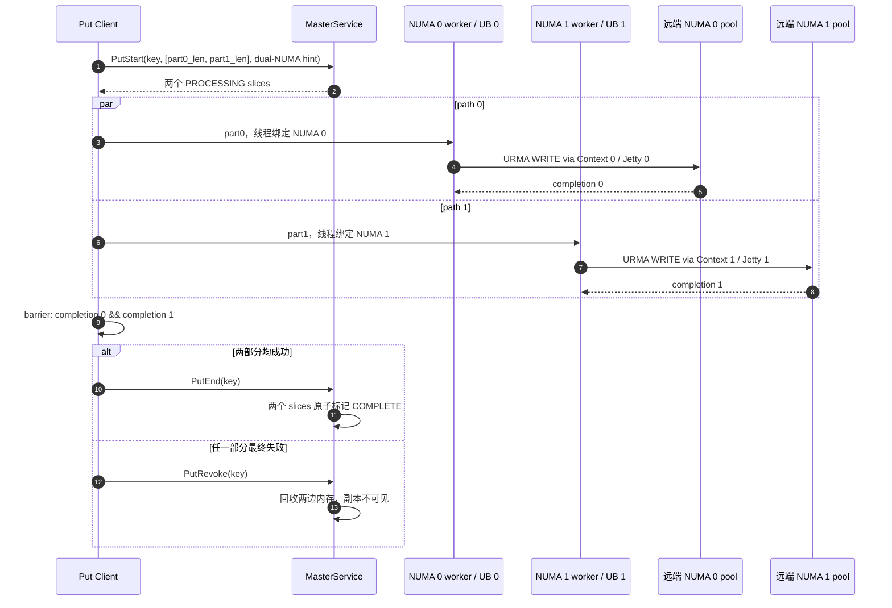
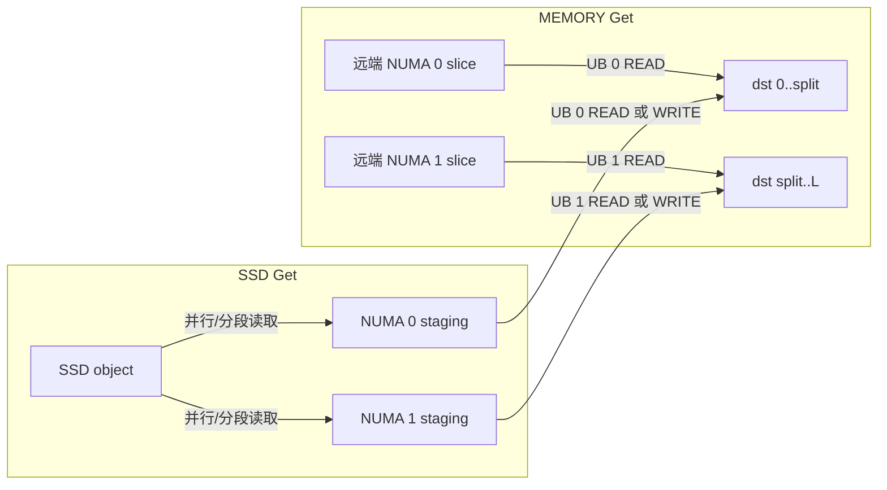

# Mooncake Transfer Engine 与 Kunpeng UB 使能指南

本文从架构和使用两个角度介绍 Mooncake Transfer Engine（下文简称 TE），并说明如何在当前代码中编译、启用和验证 Kunpeng UB（Unified Bus）传输。

> [!NOTE]
> 本文中的 **UB** 指基于 URMA（Unified Remote Memory Access）的 Kunpeng UB Transport，对应编译选项 `USE_UB` 和运行时协议名 `ub`。它与昇腾 NPU 的 `UBSHMEM`（编译选项 `USE_UBSHMEM`、协议名 `ubshmem`）是两条不同的数据通路，不应混用。

## 1. TE 是什么

TE 是 Mooncake 的高性能数据搬运层。它向上提供统一的异步批量读写接口，向下接入 TCP、RDMA、EFA、UB、NVLink、NVMe-oF 等 Transport，使调用方不必直接管理不同网络或设备 API。

TE 的核心能力包括：

- **统一传输抽象**：上层使用相同的 Segment、Buffer 和 BatchTransfer 模型访问 DRAM、显存或持久化存储。
- **零拷贝/单边访问**：在 RDMA、UB 等 Transport 中，注册后的内存可直接参与远程读写，减少 CPU 参与和中间拷贝。
- **异步批处理**：一次提交多个不连续的传输请求，并通过状态接口查询完成情况。
- **拓扑感知**：根据内存位置与设备拓扑选择合适的 NIC；大请求还可切片到多个路径并行执行。
- **多 Transport 管理**：`TransferEngine` 负责 Transport 的安装、内存注册、元数据和请求分发，具体数据面由各 Transport 实现。

### 1.1 核心对象

| 对象 | 作用 |
|---|---|
| `TransferEngine` | 面向用户的统一入口，负责初始化、Transport 管理、内存注册、Segment 管理和任务提交 |
| `Transport` | 传输后端抽象；`UbTransport`、`RdmaTransport`、`TcpTransport` 等实现具体协议 |
| Segment | 一个进程对外暴露的逻辑地址空间；通常以节点唯一的 `local_server_name` 标识 |
| Buffer | Segment 中已注册的一段连续内存，包含地址、长度、内存位置和协议访问凭据 |
| `TransferRequest` | 一项 READ/WRITE 请求，描述本地地址、远端 Segment、远端偏移和长度 |
| Batch | 一组异步请求的生命周期容器，由 Batch ID 标识 |
| `TransferMetadata` | 发布和查询节点、Segment、Buffer、设备以及握手信息 |
| `Topology` | 描述 CPU/加速器内存与 NIC 的亲和关系，辅助选择传输路径 |

### 1.2 控制面与数据面

TE 可以分为两条相互配合的路径：

```text
应用 / Mooncake Store
        |
        | init、注册内存、打开 Segment、提交 Batch
        v
  TransferEngine / MultiTransport
        |
        +---- 控制面：TransferMetadata + RPC/P2P 握手
        |             发布 Segment/Buffer，交换连接信息
        |
        +---- 数据面：TCP / RDMA / UB / ... Transport
                      注册内存，建连，执行 READ/WRITE，完成通知
```

元数据服务可以是 etcd、Redis、HTTP，也可以在测试或点对点场景使用 `P2PHANDSHAKE`。所有节点必须使用可互通的地址，并且 `local_server_name` 在参与通信的节点间必须唯一。

### 1.3 一次传输的典型流程

1. 调用 `TransferEngine::init()` 初始化元数据与握手服务。
2. 自动安装 Transport，或显式调用 `installTransport()` 安装指定协议。
3. 调用 `registerLocalMemory()` 注册本地 Buffer；TE 将协议访问描述发布到元数据。
4. 调用 `openSegment()` 获取远端 Segment handle。
5. 申请 Batch ID，构造一个或多个 `TransferRequest`。
6. 调用 `submitTransfer()`；Transport 对请求切片、选路并异步执行。
7. 使用 `getTransferStatus()` 或 `getBatchTransferStatus()` 轮询结果。
8. 释放 Batch ID、关闭 Segment，并在内存释放前取消注册。

READ/WRITE 的方向以本地进程为参照：READ 将远端数据读入本地地址，WRITE 将本地数据写到远端地址。请求涉及的本地和远端内存必须已经注册，且地址范围不能越界。

## 2. UB 如何接入 TE

UB 与 RDMA、TCP 位于同一 Transport 抽象层。当前实现的主要组件如下：

```text
TransferEngine
  `- MultiTransport
       `- UbTransport
            |- UbContext（每个 URMA 设备一份上下文）
            |    |- JFC/JFCE 等完成队列资源
            |    `- 本地内存段注册信息
            |- UbEndpoint / UrmaEndpoint（按对端建立连接）
            `- WorkerPool（提交、轮询完成和失败重试）
```

`UbTransport::install()` 会初始化 UB 资源、分配本地 Segment ID、启动握手服务并发布 Segment 描述。注册内存时，每个 `UbContext` 调用 URMA 接口注册内存段，并把远程访问所需描述写入 TE 元数据。首次访问远端时，双方通过 TE 握手交换 Jetty 和内存段信息；随后数据面使用 URMA READ/WRITE 完成单边传输。

大请求会按 TE 的 `slice_size` 切片。UB Transport 根据本地、远端 Buffer 及拓扑选择设备，将切片投递到对应 Context，并通过完成队列更新 Batch 状态；失败切片可按全局重试配置重新选路和提交。

## 3. 编译时使能 UB

### 3.1 前置条件

生产环境需要：

- 支持原生 UB 的 Kunpeng 平台及匹配的 openEuler/驱动环境；
- UMDK/URMA 运行库，例如 `/usr/lib64/liburma.so`；
- 可用的 URMA 设备，可通过 `urma_admin -l` 查看；
- Mooncake 的通用构建依赖和 `UbDiag` 依赖。

当前构建逻辑在启用 `USE_UB` 后会通过 `mooncake-common/FindUrma.cmake` 获取固定版本的 UMDK 头文件，因此首次配置需要能够访问其代码仓库。UB 子目录会在 `/usr/lib64` 查找 `liburma.so`。若未找到，代码会编入 mock URMA 实现并打印警告；该模式用于开发和单元测试，不能替代真实 UB 数据面。

### 3.2 配置和构建

在仓库根目录执行：

```bash
cmake -S . -B build \
  -DUSE_UB=ON \
  -DCMAKE_BUILD_TYPE=RelWithDebInfo

cmake --build build -j
```

配置日志至少应包含：

```text
ub transport is enabled
Enabled USE_UB protocol support
Using real URMA library: /usr/lib64/liburma.so
```

如果最后一行变成 `Not Found liburma.so building ub_transport with Mock URMA library`，应先修复 URMA 安装或库搜索路径，再生成生产构建。

可以用以下命令检查构建结果是否链接了真实 URMA 库：

```bash
ldd build/mooncake-transfer-engine/example/transfer_engine_bench | grep urma
```

> [!IMPORTANT]
> 当前 CMake 并不使用 `-DURMA_INCLUDE_DIR=...` 或 `-DURMA_LIBRARY=...` 覆盖上述查找流程。部署脚本若依赖这两个参数，需要同步修改 CMake 后才能生效。

## 4. 运行时使能 UB

编译打开 `USE_UB` 只是把后端纳入二进制。运行时还必须选择 `ub` 协议并让 TE 发现正确的 URMA 设备。

### 4.1 Mooncake Store

启动 Store 客户端时将协议配置为 `ub`，并满足以下二选一条件：

- 开启自动发现；TE 初始化时发现拓扑并自动安装 `ub` Transport。
- 关闭自动发现，同时显式提供设备名；Store 会调用 `Topology::discover(devices)`，然后安装 `ub` Transport。多个设备名使用英文逗号分隔。

也就是说，完整的使能链路是：

```text
-DUSE_UB=ON
      -> 二进制包含 UbTransport
protocol=ub
      -> Store 选择 UB 分支
auto discovery 或 device_names
      -> Topology 获得 URMA 设备
installTransport("ub")
      -> 初始化资源、启动握手并发布元数据
```

若自动发现关闭且没有设备名，Store 会返回参数错误，而不是回退到 TCP/RDMA。

### 4.2 使用 `transfer_engine_bench` 验证

先确认设备名：

```bash
urma_admin -l
```

以下示例使用 `P2PHANDSHAKE`，不依赖外部元数据服务。把 IP、端口和 `urma0` 替换为真实值，并确保两端端口可达。

目标端：

```bash
build/mooncake-transfer-engine/example/transfer_engine_bench \
  --mode=target \
  --protocol=ub \
  --device_name=urma0 \
  --metadata_server=P2PHANDSHAKE \
  --local_server_name=10.0.0.2:12345
```

发起端：

```bash
build/mooncake-transfer-engine/example/transfer_engine_bench \
  --mode=initiator \
  --protocol=ub \
  --device_name=urma0 \
  --metadata_server=P2PHANDSHAKE \
  --local_server_name=10.0.0.1:12345 \
  --segment_id=10.0.0.2:12345 \
  --operation=write
```

多设备时可传入逗号分隔的列表，例如 `--device_name=urma0,urma1`。也可使用 `--auto_discovery`，此时 `TransferEngineImpl::init()` 会在拓扑发现后自动安装编译进来的 UB Transport。

## 5. UB 运行参数

下列环境变量由当前 TE 配置加载逻辑识别：

| 环境变量 | 默认值 | 含义 |
|---|---:|---|
| `MC_URMA_TRANS_MODE` | `RM` | URMA 传输模式，可选 `RM`、`RC`、`UM` |
| `MC_URMA_ACTIVE_PORT` | `-1` | 指定活动端口索引；未设置时扫描并自动选择 |
| `MC_URMA_BONDING_BALANCE` | 关闭 | 只要变量存在就开启 bonding BALANCE + PORT 模式 |
| `MC_URMA_BONDING_MULTIPATH_ENABLE` | 关闭 | 值为 `true`、`1` 或 `on` 时开启 bonding 多路径 |

示例：

```bash
export MC_URMA_TRANS_MODE=RM
export MC_URMA_ACTIVE_PORT=0
export MC_URMA_BONDING_MULTIPATH_ENABLE=true
```

除非已经确认设备及交换网络的模式，建议保留默认值。特别注意，`MC_URMA_BONDING_BALANCE=0` 仍会因为变量存在而开启该选项；要关闭它，应取消设置：

```bash
unset MC_URMA_BONDING_BALANCE
```

## 6. 当前核心数据流程

本节从 Mooncake Store 的对象语义出发，说明 Put/Get 在内存和 SSD 两级介质上的完整路径。图中的 Master 只承载元数据和副本状态，数据本身不经过 Master；跨节点的数据面由 TE 选择 UB Transport，并最终转换为 URMA READ/WRITE。

### 6.1 Put：应用内存到远端内存



Put 以 `PutStart`/`PutEnd` 形成提交协议。只有全部数据切片传输成功后才调用 `PutEnd`；任一切片失败则撤销本次 Put，不能向读请求暴露半写入对象。

### 6.2 Put：内存副本下沉到 SSD

SSD 不是 Put 数据面的直接目标。当前路径先完成 MEMORY 副本，再由后台 Offload 将其写入本地 SSD：



URMA 只负责取得内存副本；SSD 写入由存储后端完成。是否立即释放 MEMORY 副本取决于 offload/eviction 配置，但 `LOCAL_DISK` 副本必须在 SSD 写入成功后才能标记为 `COMPLETE`。

### 6.3 Get：从远端内存读取



Get 返回前必须等待本次 Batch 的所有切片完成。远端对象可以由多个不连续 slice 组成，TE 按对象逻辑偏移将数据依次写入调用方目标 Buffer。

### 6.4 Get：从远端 SSD 读取

SSD 数据不能直接作为 URMA SGE，必须先读入已注册的 staging buffer。当前默认 Pull 路径如下；启用 Push 模式时，最后的数据方向改为数据持有方发起 `URMA_OPC_WRITE`。





当 Get 命中 SSD 且开启 promotion 时，Master 还可异步创建新的 MEMORY 副本；这不会改变当前 Get 必须先经 staging buffer 返回数据的事实。

## 7. Jetty 资源分配与调度

### 7.1 资源层级



资源分配规则如下：

1. 每个 URMA 设备创建一个 `UrmaContext`。Context 创建 `num_jfc_per_ctx` 个发送 JFC，并创建相同数量的接收 JFC/JFR；发送 JFC 深度由 `max_jfc_e` 控制，当前默认值为 4096。
2. 每个 Endpoint 创建 `num_jetty_per_ep` 个 Jetty，当前默认值为 1。Endpoint 构造时通过 Context 的递增索引轮询取得一个发送 JFC，因此同一 Endpoint 下的所有 Jetty 共享该 JFC，不同 Endpoint 均匀分摊到 Context 的 JFC 池。
3. 每个 Jetty 的软件在途上限为 `max_wr`，默认 256；Endpoint 同时受共享 JFC 的 `max_jfc_e` 总在途上限约束。实际一次可投递数量为 `min(Jetty 剩余深度, JFC 剩余深度, 待提交切片数)`。
4. 当 `num_jetty_per_ep > 1` 时，每次 `submitPostSend` 随机选择一个 Jetty；一次调用中获准提交的 WR 链全部投到该 Jetty。当前不是最短队列调度，也不保证同一个对象固定使用同一个 Jetty。
5. 首次向某个远端 NIC 传输时懒建连接。主动端通过握手交换 EID 和 Jetty ID，双方按相同索引逐个 `import`、`bind`；两端 `num_jetty_per_ep` 不一致时建连失败。
6. 设备能力会限制资源总量：`max_ep_per_ctx × num_jetty_per_ep` 不能超过设备 `max_jetty`，超出时下调最大 Endpoint 数；`num_jfc_per_ctx` 也不能超过设备 `max_jfc`。

### 7.2 面向双 NUMA 的分配约束

双 NUMA 并行不应仅依赖“多 Jetty”。Jetty 属于某个 URMA 设备的 Context，不能跨设备复用；要同时使用两颗 CPU 亲和的 UB 带宽，必须建立两条独立的数据路径：

| 数据分片 | 内存池 | 执行线程 | 本地 UB Context | 远端目标 |
|---|---|---|---|---|
| part 0 | NUMA 0 pool | 绑定 CPU/NUMA 0 | NUMA 0 亲和的 UB 设备 | 远端 part 0 pool |
| part 1 | NUMA 1 pool | 绑定 CPU/NUMA 1 | NUMA 1 亲和的 UB 设备 | 远端 part 1 pool |

每条路径拥有自己的 Endpoint/Jetty 和完成队列记账。对象级完成状态由上层聚合，不能用任一单路径的完成事件代表整个 Put/Get 完成。

## 8. 双 NUMA 亲和设计方案

> [!IMPORTANT]
> 本节是目标设计，不代表当前代码已经实现。现状具备 NUMA 拓扑发现、内存注册、请求切片和多设备选路能力，但 Store 的一次 Put 尚未强制将对象等分到两个 NUMA 内存池。

### 8.1 目标与原则

- 每次满足并行条件的 Put 将对象拆成两个逻辑连续部分，分别落到两颗 CPU 对应的本地内存池。
- part 0 和 part 1 分别使用 NUMA 本地线程、内存和 UB 设备并发传输，聚合两条 UB 链路带宽。
- Get 按对象逻辑偏移重组数据，对调用方仍呈现一个连续对象；Put/Get API 和 key 语义保持不变。
- 失败、重试、回收以整个对象为原子单位，不暴露只有一半完成的副本。
- SSD offload 保留两个 slice 的逻辑顺序；读盘后的网络传输仍可沿两条 NUMA 路径并行。

### 8.2 对象切分与元数据

设对象长度为 `L`，以配置的对齐粒度 `A`（建议至少为页大小，并与 TE `slice_size` 协调）计算：

```text
split = min(L, align_up(ceil(L / 2), A))
part0 = [0, split)
part1 = [split, L)
```

若对齐后 `part1` 为空，或对象小于 `dual_numa_min_size`，退化为单 NUMA 路径，避免双路调度成本超过带宽收益。副本元数据继续使用有序 slice 列表表达，无需改变对象 API：

```yaml
key: example
size: L
replica_state: PROCESSING | COMPLETE
slices:
  - logical_offset: 0
    length: split
    segment: memory_pool_numa_0
    numa_node: 0
  - logical_offset: split
    length: L - split
    segment: memory_pool_numa_1
    numa_node: 1
```

实际实现中若现有 slice 结构没有 `logical_offset`/`numa_node` 字段，可以由有序 slice 的累计长度推导逻辑偏移，并由 Segment/Buffer 的拓扑位置推导 NUMA，避免重复存储；但必须保证序列化后顺序稳定。

### 8.3 Put 并行流程



关键实现要求：

- `PutStart` 一次性预留两个池的空间；任一池空间不足时整体失败或整体退化到单 NUMA，不能先提交一半再决定。
- 两个子任务共用对象级 trace/batch，分别记录 path 状态；完成 barrier 之后才能执行 `PutEnd`。
- 每条路径只注册并访问本 NUMA 的内存段，worker 线程绑定对应 CPU 集合，避免页首次触碰或完成处理落到另一 NUMA。
- 重试优先保持 NUMA 亲和路径；对应 UB 设备故障时允许跨 NUMA 降级，但应记录 degraded 指标，避免静默产生跨 Socket 流量。

### 8.4 Get 与 SSD 路径

内存 Get 读取元数据中的两个有序 slice，并行发起两个 READ，分别写到调用方 Buffer 的 `[0, split)` 和 `[split, L)`。如果调用方目标内存本身也跨两个 NUMA 池，优先做 NUMA 对称传输；若目标是单块内存或设备显存，则以目标拓扑为主选路，双链路只是软目标，不能为了并行制造额外跨 NUMA 拷贝。



Offload 写盘时有两种实现选择：优先将两个内存 slice 按逻辑偏移写入同一 SSD 对象，保持现有 key/SSD 元数据模型；只有存储后端能够原子管理多 extent 时，才考虑物理拆成两个 SSD extent。无论采用哪种方式，SSD 副本发布必须晚于两个分片全部落盘。

### 8.5 配置、降级与可观测性

建议新增以下配置，名称可在实现阶段按项目约定调整：

| 配置 | 建议默认值 | 作用 |
|---|---:|---|
| `dual_numa_enabled` | `false` | 控制方案灰度启用 |
| `dual_numa_nodes` | 自动发现两个 UB 亲和 NUMA | 指定参与拆分的 NUMA node |
| `dual_numa_min_size` | 压测确定，例如 1 MiB | 小于阈值走单 NUMA |
| `dual_numa_alignment` | 4 KiB 或 hugepage 粒度 | 控制切分和分配对齐 |
| `dual_numa_fallback` | `single_numa` | 一条路径不可用时的降级策略 |

至少增加以下指标：双路/单路 Put 次数、每条路径字节数和吞吐、两路完成时间差、跨 NUMA fallback 次数、双池分配失败数、对象级撤销数，以及按 UB Context/Jetty/JFC 统计的队列深度。日志应携带相同 `trace_id`、`key_hash`、`part_index`、`numa_node` 和设备名，以便关联两条路径。

### 8.6 正确性与性能验收

1. 覆盖 0/1 字节、奇数长度、非对齐长度、大对象和多 slice 对象，Get 内容必须与 Put 输入逐字节一致。
2. 注入任一 NUMA 池分配失败、任一 UB 路径提交失败/超时以及单边完成丢失，Master 不得出现半完成副本，也不得泄漏另一半内存。
3. 验证 Offload/Load、promotion、eviction 和进程重启恢复后，两个 slice 的顺序、长度及校验值不变。
4. 用单 NUMA 作为基线，分别测带宽、P50/P99 延迟和 CPU 使用率；大对象双路吞吐应接近两条 UB 链路可用带宽之和，同时监控跨 Socket 内存流量。
5. 压测共享 JFC 的在途深度。如果多 Endpoint 竞争导致 `jfc_full`，应先增加/隔离 JFC 或改进调度，再单纯增加 `num_jetty_per_ep`；增加 Jetty 本身不能突破共享 JFC 上限。

## 9. 验证与排障

### 9.1 建议的验证顺序

1. `urma_admin -l` 能看到预期设备，端口状态为 active。
2. 构建日志显示找到真实 `liburma.so`，`ldd` 能看到 URMA 动态库。
3. 两端使用不同且可解析/可达的 `local_server_name`。
4. 两端使用相同的元数据方式，或都使用 `P2PHANDSHAKE`。
5. 日志出现 `UbTransport: initialize Ub resources done`、`start handshake daemon done` 和 `publish segments done`。
6. 先用小 Buffer、单设备、单 Batch 完成读写，再增加并发和多路径。

### 9.2 常见问题

| 现象 | 常见原因 | 处理方式 |
|---|---|---|
| CMake 未出现 UB 相关日志 | 没有传 `-DUSE_UB=ON`，或复用了旧缓存 | 检查 `build/CMakeCache.txt`，重新执行 CMake 配置 |
| 构建使用 mock URMA | `/usr/lib64/liburma.so` 不存在或不可见 | 安装匹配版本 UMDK/URMA，确认动态库路径 |
| 找不到设备或 Context 初始化失败 | 驱动/内核模块未加载、设备名错误、端口未激活 | 使用 `urma_admin` 检查设备和端口；核对 `device_name` |
| 安装 UB Transport 失败 | Topology 中没有 HCA，且未正确指定设备 | 开启自动发现，或显式提供有效 URMA 设备名 |
| `openSegment()` 失败 | 对端未发布元数据、Segment 名不一致或网络不可达 | 核对对端 `local_server_name`、元数据地址和握手端口 |
| 首次请求超时 | Jetty 握手失败或防火墙阻断 | 检查双方握手日志、监听地址、端口与路由 |
| 注册内存失败 | 地址/长度无效、资源限制或 URMA 注册失败 | 确保内存在传输期间有效且页范围正确，检查系统与设备限制 |
| 传输状态持续异常 | 请求越过已注册 Buffer，或远端 offset/length 越界 | 对照注册范围检查本地地址和远端偏移 |

## 10. 代码导航

- TE 公共 API：`mooncake-transfer-engine/include/transfer_engine.h`
- TE 初始化与自动安装：`mooncake-transfer-engine/src/transfer_engine_impl.cpp`
- 多 Transport 管理：`mooncake-transfer-engine/src/multi_transport.cpp`
- UB Transport：`mooncake-transfer-engine/src/transport/kunpeng_transport/ub_transport.cpp`
- UB Context：`mooncake-transfer-engine/src/transport/kunpeng_transport/ub_context.cpp`
- URMA Endpoint：`mooncake-transfer-engine/src/transport/kunpeng_transport/urma/urma_endpoint.cpp`
- UB 编译开关：`mooncake-common/common.cmake`
- URMA 头文件获取：`mooncake-common/FindUrma.cmake`
- Store 的协议选择：`mooncake-store/src/client_service.cpp`
- TE Benchmark：`mooncake-transfer-engine/example/transfer_engine_bench.cpp`

更细的通用 TE 架构可参考 [Transfer Engine](index.md)，UB 的平台依赖和组件说明可参考 [Kunpeng UB Transport](kunpeng_ub_transport.md)。
